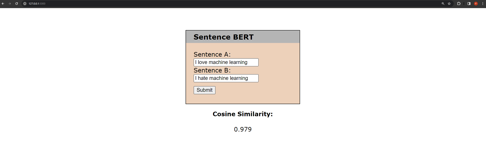

# NLP-A5-Sentence-BERT
 
## Description:
Find cosine similarity of a sentence pair using Sentence BERT model.

## How to use:
1) From the terminal, use the 'cd' command change directory to 'NLP-A4-Resume-Parser/app/' folder.
2) Run the Python script 'app.py'.
3) Open your browser and go to '127.0.0.1:5000' to access the site locally.
4) Input the two sentences you which to compare in the 'Sentence A' and 'Sentence B' input boxes respectively.
5) Once you click submit, the cosine similarity of the two input sentences will display below.

A cosine similarity ranges between -1 and 1 in which:
- Value closer to 1 means that the two sentences have a very similar meaning. E.g., `I love summer.` and `Summer is my favorite season.`
- Value closer to -1 means that the two sentences have an opposite meaning. E.g., `I love going to school.` and `I hate going to school.`
- Value closer to 0 means that the two sentences are irrelevant to each other. E.g., `My cat is so cute.` and `I'm feeling quite hungry.`

